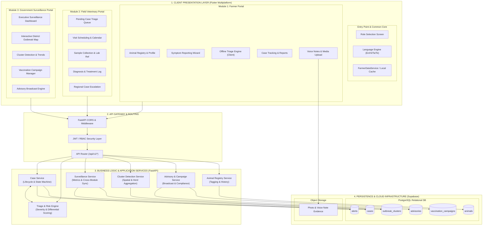
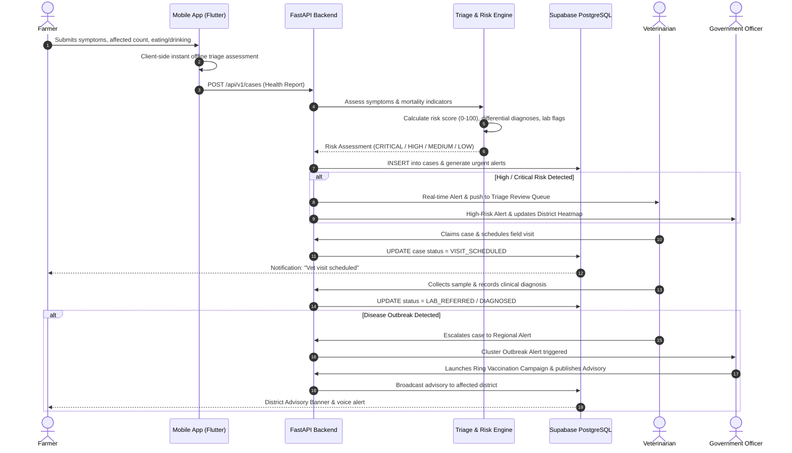

# Smart Livestock (Pashu Seva) — Technical Architecture

This document details the end-to-end technical architecture of the **Smart Livestock Animal Health Surveillance System**, covering the multi-role Flutter frontend, the FastAPI backend services, the AI/Rule-based Risk & Triage Engine, and the Supabase cloud persistence layer.

---

## 1. System Architecture Overview

---

## 2. Risk Engine & Case Lifecycle Data Flow

The diagram below details the continuous feedback loop between the **Farmer**, the **Risk Engine**, the **Field Veterinarian**, and the **Government Surveillance Authority**:

---

## 3. Core Component Descriptions

### A. Presentation Layer (Flutter Multiplatform)
- **Unified Engine**: Single codebase deployed to Android, iOS, Windows Desktop, and Web.
- **Role-Based Architecture**: Dynamically switches view shells (`FarmerShell`, `VetShell`, `GovtShell`) based on user credentials.
- **Multilingual Support**: Real-time localization (`LocalizationService`) supporting English, Hindi, Tamil, and Telugu.
- **Offline-First Resilience**: Local caching in `FarmerDataService` with graceful fallback when connectivity drops.

### B. Business Logic Layer (FastAPI)
- **TriageService**: Evaluates mortality, respiratory/salivation indicators, and herd transmission count to generate standardized risk scores.
- **CaseService**: Implements a deterministic state machine for clinical reports (`SUBMITTED` $\to$ `UNDER_REVIEW` $\to$ `VISIT_SCHEDULED` $\to$ `SAMPLE_COLLECTED` $\to$ `TREATMENT_STARTED` $\to$ `RESOLVED`).
- **SurveillanceService**: Aggregates spatial data to provide statistical summaries, cluster warnings, and district risk percentages.

### C. Data & Infrastructure Layer (Supabase)
- **Relational Integrity**: Foreign-key linked schemas tracking animals, case timelines, laboratory results, and district coordinates.
- **Row-Level Security (RLS)**: Enforces access boundaries between public farmers, certified veterinarians, and state administrators.
- **Binary Evidence Storage**: Buckets for farmer audio notes, symptom photos, and laboratory reports.
